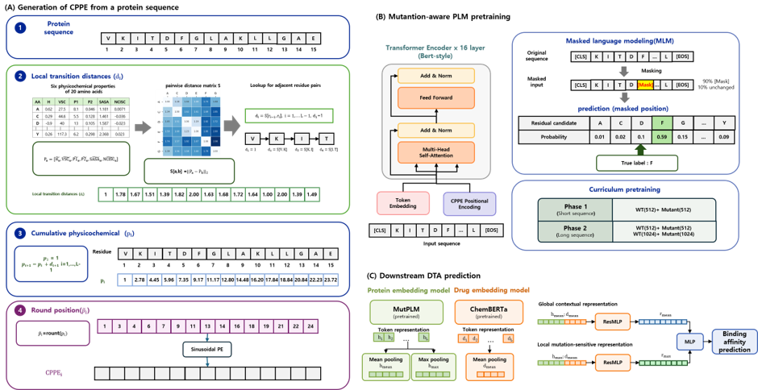
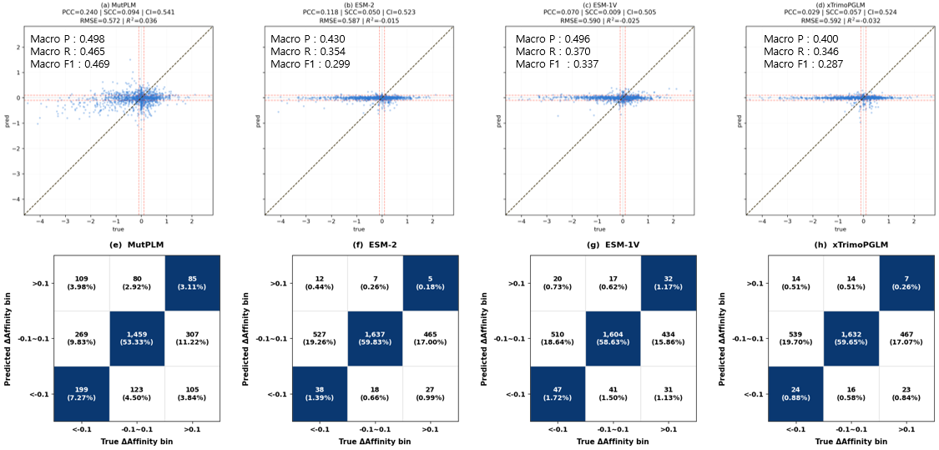

# MutPLM_DTA



## WT–Mutant 결합 친화도 변화 방향 평가



- DAVIS 데이터를 활용하여 동일 약물에 대한 WT와 Mutant의 실제 결합 친화도 변화와 모델이 예측한 결합 친화도 변화를 비교
- WT와 Mutant의 affinity 차이(ΔAffinity)를 기준으로 **감소(ΔAffinity < -0.1), 유지(-0.1 ≤ ΔAffinity ≤ 0.1), 증가(ΔAffinity > 0.1)**의 3개 클래스로 구분
- 실제 affinity가 감소한 경우 모델도 감소로, 증가한 경우 증가로, 변화가 작은 경우 유지로 예측했는지를 평가하여 **mutation에 따른 결합 친화도 변화 방향을 모델이 올바르게 예측하는지 검증**
- 동일 약물–WT·Mutant 2,736쌍을 대상으로 변화 방향 예측 성능을 평가한 결과, 기존 단백질 언어모델 기반 모델(ESM-2 macro F1 0.299, ESM-1V 0.337, xTrimoPGLM 0.287) 대비 MutPLM 기반 모델에서 macro F1 **0.469**를 기록

약물-단백질 결합 친화도(DTA) 예측 파이프라인.
**PLM 사전학습 → 전처리(임베딩+npz) → DTA 학습 → 예측** 순서.

```
MutPLM_DTA/
├── environment.yml
├── preprocess_dataset.py        # 데이터셋 이름만 주면 임베딩+npz 자동 생성
├── PLM/                          # 단백질 언어모델 (사전학습 + 임베딩 추출)
├── DLM/                          # 약물(SMILES) 임베딩 추출 (ChemBERTa)
├── DTA_dataset/                  # 원본 csv (DAVIS, ChEMBL IC50/Kd/Ki) + 조립 스크립트
├── chembl35_dataset_preprocessing/  # ChEMBL 원본 → DTA_dataset/chembl_35 변환 노트북
├── emb/{DAVIS-complete,IC50,Kd,Ki}/{protein,drug}.npz
├── DTA_model_npz/{DAVIS-complete,IC50,Kd,Ki}/fold1~5/*.npz
└── DTA_model/                    # 학습(train.py)/예측(predict.py) + result/
```

## 0. 환경

```bash
conda env create -f environment.yml   # env: MutPLM_DTA
conda activate MutPLM_DTA
```

## 1. PLM 사전학습


```bash
cd PLM
python pretrain.py --config MutPLM.yaml
```

## 2. 데이터 전처리 (단백질/약물 임베딩 + fold npz)

**데이터셋 이름만 주면 된다.** unique 목록 생성 → PLM/ChemBERTa 임베딩 추출 → fold별 npz 조립까지 전부 자동이고, 이미 있는 결과는 건너뛴다.

```bash
python preprocess_dataset.py --dataset IC50   # DAVIS / IC50 / Kd / Ki
```

- IC50/Kd/Ki는 단백질·약물이 겹치는 게 많아서 unique 목록은 `DTA_dataset/chembl_35/unique_*.csv` 하나를 같이 쓰지만, 임베딩(`emb/<이름>/`)과 fold npz(`DTA_model_npz/<이름>/`)는 데이터셋별로 따로 저장된다.
- `test_non5_*`(단백질 저빈도 홀드아웃) 스플릿은 용량이 커서(파일당 수백MB) 기본으로 만들지 않는다. 필요하면 `preprocess_dataset.py`의 `CHEMBL_SPLITS`에 추가.
- 세부 단계(단백질/약물 임베딩 스크립트, npz 조립 스크립트)를 직접 쓰고 싶으면 `PLM/extract_protein_embeddings.py`, `DLM/extract_drug_embeddings.py`, `DTA_dataset/collect_unique.py`, `DTA_dataset/build_npz.py` 각각 `--help` 참고.
- ChEMBL 원본(`chembl_data/`)에서 `DTA_dataset/chembl_35`가 어떻게 만들어지는지는 `chembl35_dataset_preprocessing/chembl35_data_processing.ipynb` 참고.

## 3. DTA 모델 학습

**데이터셋 이름만 주면 된다.** npz가 없으면 2단계를 먼저 자동 실행한 뒤 학습을 시작한다.

```bash
python DTA_model/train.py --dataset IC50 --resume   # DAVIS / IC50 / Kd / Ki
```

- 5-fold 순차 학습(fold당 최대 1000 epoch, early stopping patience=80). `--resume`으로 중단된 fold부터 이어감.
- 결과: `DTA_model/result/<이름>/foldN/{best.pth, last.pth, test_summary.csv, runs/}`
- npz 위치를 직접 지정하려면 `--data_dir`/`--result_dir`을 쓸 수 있다 (이 경우 자동 생성 없음).

## 4. DTA 예측

```bash
python DTA_model/predict.py \
  --model_dir DTA_model/result/IC50 \
  --npz_files DTA_model_npz/IC50/fold1/test_data.npz \
  --save_dir predictions/
```

- 예측 입력 npz는 학습 입력과 같은 스키마(`ID, SMILES, protein, affinity, drug_embedding, protein_embedding, protein_max_embedding`)여야 한다. 새 샘플을 예측하려면 2단계와 같은 방식(`extract_protein_embeddings.py` → `extract_drug_embeddings.py` → `build_npz.py`)으로 npz를 만들면 된다.
- `--model_root DTA_model/result --datasets DAVIS-complete Kd Ki IC50`으로 여러 데이터셋 모델을 한 번에 돌릴 수 있다.
- 출력 csv: `pred_fold1~5`(fold별 예측), `pred_mean`(최종 예측값), `pred_std`(불확실성).
